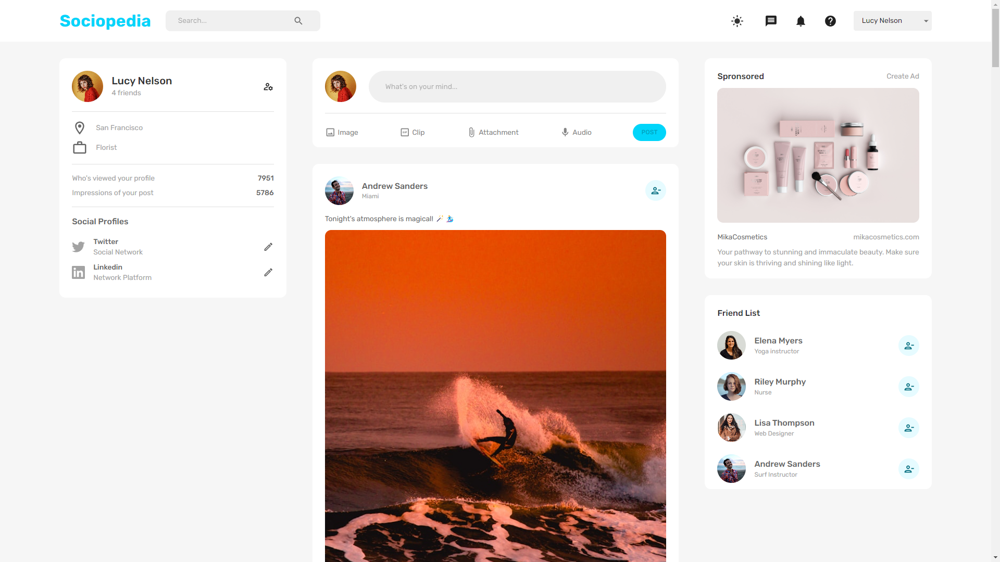
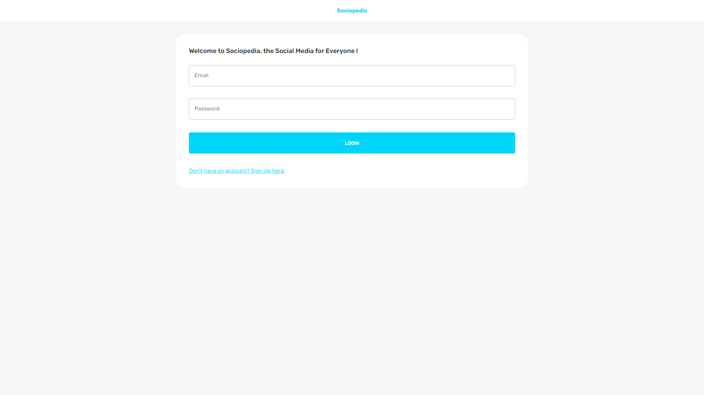
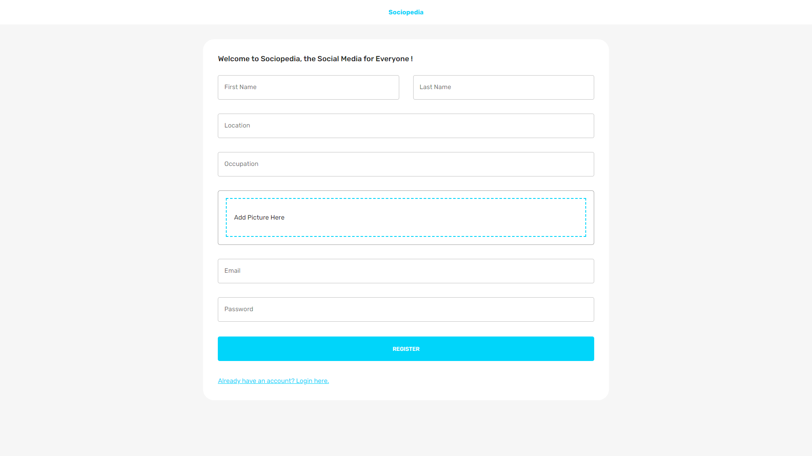
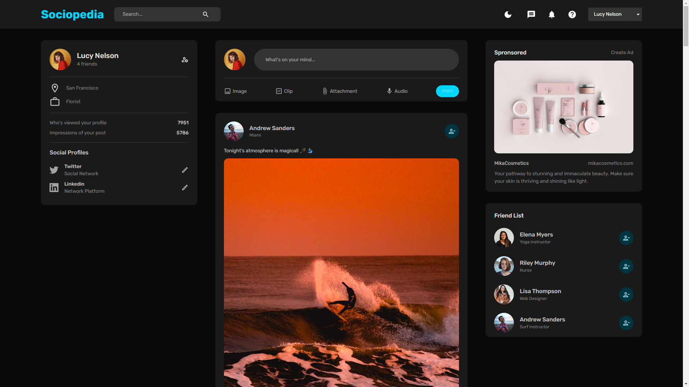
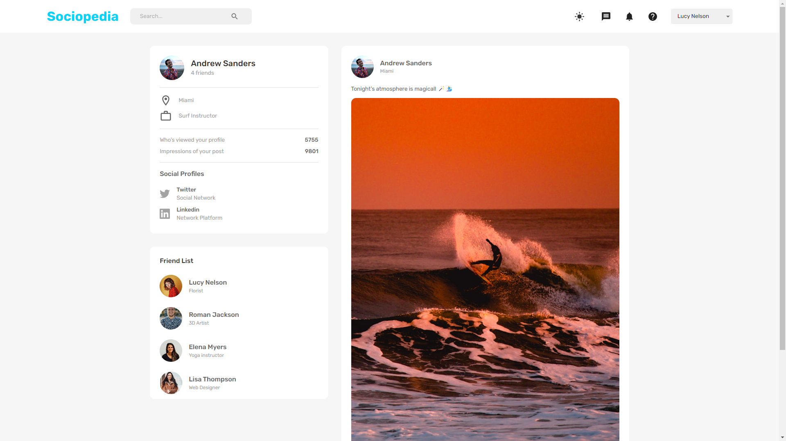

<a id="readme-top"></a>

<!--
*** This README is built upon the Best-README-Template, created by Othneil Drew.
*** If you wish to use this template, go check his repository :
*** https://github.com/othneildrew/Best-README-Template/tree/master
*** And don't forget to give his project a star!
-->

<!-- PROJECT TITLE -->

<div align="center">
  <a href="https://sociopedia-6qm6.onrender.com/">
    
  </a>
</div>
<h1 align="center">Sociopedia</h1>

<!-- TABLE OF CONTENTS -->

<details>
  <summary>Table of Contents</summary>
  <ol>
    <li>
      <a href="#about-the-project">About The Project</a>
      <ul>
        <li><a href="#built-with">Built With</a></li>
      </ul>
    </li>
    <li>
      <a href="#getting-started">Getting Started</a>
      <ul>
        <li><a href="#prerequisites">Prerequisites</a></li>
        <li><a href="#backend">Backend</a></li>
        <li><a href="#frontend">Frontend</a></li>
      </ul>
    </li>
    <li><a href="#usage">Usage</a></li>
    <li><a href="#modifications">Modifications</a></li>
    <li><a href="#improvements">Improvements</a></li>
    <li><a href="#contact">Contact</a></li>
    <li><a href="#acknowledgments">Acknowledgments</a></li>
    <li><a href="#license">License</a></li>
  </ol>
</details>

<!-- ABOUT THE PROJECT -->

<h2 id="about-the-project">About The Project</h2>



If you want to take a direct look at this project, you can do so right [here](https://sociopedia-6qm6.onrender.com/).

This project was built following this [tutorial](https://www.youtube.com/watch?v=K8YELRmUb5o).

Sociopedia is a social media web app, built using the MERN Stack (MongoDB, Express.js, React, Node.js).

On the backend, we have some basic CRUD operations: creating an account, logging in and out, and deleting an account.
Passwords are encrypted using Bcrypt, the authentication and authorization is delt with using JSON Web Token, images are uploaded using Multer and are stored in an AWS S3 bucket.

On the frontend, we use Redux for global state management, Axios as HTTP client for API requests, Formik for form state management and validation, and React Dropzone to collect images upload. The styling is done using Emotion.

This project has been deployed on Render, using a free tier account, so the app has some spin up time before loading.

<p align="right">(<a href="#readme-top">back to top</a>)</p>

<h3 id="built-with">Built With</h3>

- Tech stack :

[](https://react.dev/)
[](https://nodejs.org/en)
[](https://expressjs.com/)
[](https://www.mongodb.com/)

- Tools :

[](https://create-react-app.dev/)
[](https://reactrouter.com/en/main)
[](https://jwt.io/)
[](https://jwt.io/)
[](https://jwt.io/)

<p align="right">(<a href="#readme-top">back to top</a>)</p>

<!-- GETTING STARTED -->

<h2 id="getting-started">Getting Started</h2>

<h3 id="prerequisites">Prerequisites</h3>

If you want to clone this project, you must have [Node.js](https://nodejs.org/en) installed, as well as [Git](https://git-scm.com/downloads).

1. To clone this project, first go in the directory you want to install the project in :

   ```sh
   cd path/to/your/directory
   ```

2. And then run this command to clone the project :

   ```sh
   git clone https://github.com/GWartelle/SocioPedia.git
   ```

<h3 id="backend">Backend</h3>

1. For the backend, go in the server folder, and start by running the command `npm install` to install all the packages :

   ```sh
   cd server
   npm install
   ```

2. Next, still in the server folder, use the editor of your choice, and open the `.env.example` file. For example, using VSCode, you can run this command :

   ```sh
   code .env.example
   ```

3. Update the environment variables with your own :

   ```js
   MONGO_URL=...
   JWT_SECRET=...
   PORT=...
   NODE_ENV=...
   AWS_ACCESS_KEY_ID=...
   AWS_SECRET_ACCESS_KEY=...
   AWS_REGION=...
   AWS_BUCKET_NAME=...
   ```

   For the `MONGO_URL`, you can create your own free database on [MongoDB](https://www.mongodb.com/).

   For `JWT_SECRET`, a random string of characters will do the trick.
   To easily create one, open a bash terminal and run this commmand :

   ```ba
   openssl rand -base64 32
   ```

   For the `PORT`, you can choose whichever one you prefer.

   For `NODE_ENV`, leave it as `development` unless you plan to deploy the app, in which case you should change it to `production`.

   For `AWS_ACCESS_KEY_ID`, `AWS_SECRET_ACCESS_KEY`, `AWS_REGION`, and `AWS_BUCKET_NAME` you can create a free AWS S3 bucket on [AWS](https://aws.amazon.com/s3/).

4. Once it's done, change the name of the file to `.env` :

   ```sh
   mv .env.example .env
   ```

5. Lastly, to start the server using nodemon, run this command :

   ```sh
   npm run start
   ```

<h3 id="frontend">Frontend</h3>

1. For the frontend, you must go in the client folder and run the command `npm install` :

   ```sh
   cd ../client
   npm install
   ```

2. Next, still in the client folder, once again open the `.env.example` file in your editor :

   ```sh
   code .env.example
   ```

3. Update the environment variables with your own :

   ```js
   REACT_APP_API_URL=...
   ```

   This variable is simply used to store the address of your server.
   So if you only intend to use this project on your local machine, you can leave it as `http://localhost:PORT`, just making sure that PORT matches the port you choose in your backend `.env` file.
   But if you wish to deploy this app, you'll have to put the URL your server in `REACT_APP_API_URL`.

4. Once it's done, change the name of the file to `.env` :

   ```sh
   mv .env.example .env
   ```

5. Finally, to run the React app and open it automatically in your browser, run this command :

   ```sh
   npm run start
   ```

<p align="right">(<a href="#readme-top">back to top</a>)</p>

<!-- USAGE EXAMPLES -->

<h2 id="usage">Usage</h2>



You will land on the login page.
Here you can obviously log in, using your email and your password.
But if you don't have an account yet, you can click on `Don't have an account? Sign Up here.` to be redirected to the register page.



Here you will be asked to enter your first name, your last name, your location, your occupation, put your profile picture in the dropzone, enter your email, and finally your password.
If you already created an accoount you can just click on `Already have an account? Login here.`.
Once registered you will be redirected back to the login page.


Once logged in, you'll land on the home page.
To make things clear, this web app has a lot of mockup features.
This is intentional as this leaves the opportunity to implement a lot of new things once the tutorial is finished.

So, now that this is out of the way, let's dive into this home page.
At the top of the screen we have the navigation bar, with a search bar on the left.
This is the first mockup feature, as you can enter some text into the search bar, but clicking the search icon won't do anything.
This would be the opportunity to implement a profile searching feature.

On the right side we have the name of the user in a select menu, with the options of logging out and deleting the account.
Besides that, the message, notification, and help icons are also mockup features, open for implementation.
But the sun icon does work, as it toggles the dark mode on.



On the main page we found mutiple panels.
On the left, there is the User panel, with all the your info.
Here there are some mockup features too: the account parameters icon and the social profiles are here for demonstration sake.
And the views and impressions numbers are randomly generated at the creation of the user's profile.

On the center of the screen, we find the feed, with the Post panel at the top.
The post panel allows you to enter a message to post on the feed for all the other users to see.
You also have the possibility to send an image along with your message, by cliking on the image option, which pops off a dropzone where you can drag your image.
As for the other options (Clip, Attachment and Audio), those are mockup features as well.

On the feed of Sociopedia, you can see all the other users' posts.
On the top right of every posts (except yours), there is an add friend icon which adds the creator of this post to your friend list.
At the bottom of each post panel you have a heart icon for liking the post, and a comment icon for opening the comment section.
For now you can only find mockup comments in this section, as the comment feature is not implemented yet.

On the right of the screen there's an advertisement panel, which is also a mockup feature.
And finally under this panel, you have the FriendList panel, with all of your friends, with an icon on their right if you want to remove them from the list.

Speaking of friends, if your click on a user's name, you are redirected to his/her profile page.



On the top left of this page, you can find the User panel once again, but with the info of the user you cliked on this time.
Under this panel, there is also the FriendList panel, but only with the friends of this user.

On the center of the screen, there is also a feed, but this one only contains the posts of the user of this profile page.

Lastly, if you want to get back to the home page, you can simply click on the `Sociopedia` logo in the top left of the screen. And if you want to log out (or delete your account), you can do so by clicking the select menu with your user name in the top right of the screen.

<p align="right">(<a href="#readme-top">back to top</a>)</p>

<!-- MODIFICATIONS -->

<h2 id="modifications">Modifications</h2>

Compared to the original project, I changed some things here and there: I added a delete user account feature, I removed the possibility to add yourself to your own friend list, I also removed the possibility to create a post from the profile page of a user, etc ...

But one major thing I added to this project is the storage of uploaded images in an AWS S3 bucket, instead of storing them directly on the server. I decided to implement this because I deployed this project on Render, and the ability to store files on it is rather limited, as its file system is ephemeral.

So I wanted to share with you how I managed to implement this cloud storage.
Of course the first part was to create an AWS account, and create a new S3 bucket.

Once this was done, it was time to set this up on my server :

```js
/* AWS SDK SET UP */
const s3 = new S3Client({
  region: process.env.AWS_REGION,
  credentials: {
    accessKeyId: process.env.AWS_ACCESS_KEY_ID,
    secretAccessKey: process.env.AWS_SECRET_ACCESS_KEY,
  },
});
```

The first thing to do was to create a S3Client, using the credentials of my AWS S3 bucket.

```js
/* FILE STORAGE */
const upload = multer({
  storage: multerS3({
    s3: s3,
    bucket: process.env.AWS_BUCKET_NAME,
    contentType: multerS3.AUTO_CONTENT_TYPE,
    key: function (req, file, cb) {
      const filename = file.originalname
        .replace(/\s+/g, "-")
        .replace(/[^\w.-]+/g, "");
      cb(null, Date.now().toString() + "-" + filename);
    },
  }),
});
```

Next it was time to create the function for uploading files in the bucket.
Multer, as this is the tool used for uploads in this project, connects with `s3` the S3Client I just set up, and the `bucket` with the bucket name stored in the .env file.

And then Multer creates a `key` to identify the uploaded file, by combining the current date in Unix time with the name of the file without spaces or special characters.

```js
/* ROUTES WITH FILES */
app.post("/auth/register", upload.single("picture"), register);
app.post("/posts", verifyToken, upload.single("picture"), createPost);
```

This function is then called as a middleware in the register and posts routes, before the register and createPost controllers as they are the only ones with the image upload feature.

```js
/* REGISTER USER */
export const register = async (req, res) => {
  try {
    /* ... */
    const picturePath = req.file.location;

    const newUser = new User({
      /* ... */
      picturePath,
      /* ... */
    });
    const savedUser = await newUser.save();
    res.status(201).json(savedUser);
  } catch (err) {
    res.status(500).json({ error: err.message });
  }
};

/* CREATE */
export const createPost = async (req, res) => {
  try {
    /* ... */
    let picturePath;

    if (req.file) {
      picturePath = req.file.location;
    }

    const newPost = new Post({
      /* ... */
      picturePath,
      /* ... */
    });
    await newPost.save();

    const post = await Post.find();
    res.status(201).json(post);
  } catch (err) {
    res.status(409).json({ message: err.message });
  }
};
```

To simplify, I just kept the `picturePath` field of the newly created MongoDB document.

As you can see, the `register` and `createPost` controllers are both getting the image URL with `req.file.location`, which is then stored in the database.

But aside from storing uploaded images in this S3 bucket, I also implemented the possibility to delete them if the user deletes his/her account.

```js
const s3 = new S3Client({
  region: process.env.AWS_REGION,
  credentials: {
    accessKeyId: process.env.AWS_ACCESS_KEY_ID,
    secretAccessKey: process.env.AWS_SECRET_ACCESS_KEY,
  },
});

function getKeyFromUrl(url) {
  const index = url.lastIndexOf("/");
  return url.substring(index + 1);
}

async function deleteImageFromS3(imageUrl) {
  try {
    const imageKey = getKeyFromUrl(imageUrl);

    const deleteParams = {
      Bucket: process.env.AWS_BUCKET_NAME,
      Key: imageKey,
    };

    const deleteCommand = new DeleteObjectCommand(deleteParams);
    await s3.send(deleteCommand);

    console.log(`Image with key ${imageKey} deleted from S3 bucket.`);
  } catch (err) {
    console.error(`Error deleting image with key ${imageKey}: ${err.message}`);
  }
}
```

First I add to reset a S3Client, as implementing this function directly in the main file of the server would have been too cumbersome.

<p align="right">(<a href="#readme-top">back to top</a>)</p>

<h2 id="improvements">Improvements</h2>

As this project is primarily built for training purposes, it is rather light in terms of features.
Therefore, if I had more time on my hands to improve this web app, here are the features I would implement :

- Firstly, the most important point in my opinion, would be to add responsivity. This is a crucial feature for all modern web apps, and this project lacks it.
- Secondly, I would add a friend list feature. Instead of being able to send messages to every users, one user should have to ask another to be his/her friend before sending him/her a message.
- Thirdly, it'd be a great improvement if it was possible to upload images, videos and audios in discussions, as it is a staple feature in most real-time messaging apps.
- Fourthly, it would be rather logical to add some account update feature. The user would be able to choose a different profile picture, select a specific emoji to represent his/her account, and could change his/her username or password.
- Fifthly, in the same vein of the preceding feature, it would be coherent to have a password retrieval feature, as it is a staple of all modern apps.

After that, this project could benefit from other little tweaks like ordering other users' profiles based on which discussion is the most recent, or notifying the user when he/she receives a new message from another discussion, but I think this would be a good start.

<p align="right">(<a href="#readme-top">back to top</a>)</p>

<!-- CONTACT -->

<h2 id="contact">Contact</h2>

If you want to see more of my work, I invite you to go check my [portfolio](https://gwartelle.github.io/MyPortfolio/).

You can also take a look at my other projects on my [github](https://github.com/GWartelle),

And if you'd like to get in touch with me, feel free to reach out on [LinkedIn](https://www.linkedin.com/in/gabriel-wartelle/).

<p align="right">(<a href="#readme-top">back to top</a>)</p>

<!-- ACKNOWLEDGMENTS -->

<h2 id="acknowledgments">Acknowledgments</h2>

As mentionned above, this project was made following this [tutorial](https://www.youtube.com/watch?v=HwCqsOis894).
So I would like to thank its creator for his amazing work.
If you want to go check the github of his tutorial you can do so right [here](https://github.com/burakorkmez/mern-chat-app?tab=readme-ov-file).
Feel free to give him a star, as his work was well structured and his explanations clear and useful.

And of course I would like to thank you for taking the time to read through all this !
I wish you the best 😁

Have a great day 😉

<p align="right">(<a href="#readme-top">back to top</a>)</p>

<!-- LICENSE -->

<h2 id="license">License</h2>

Distributed under the MIT License. See [opensource.org](https://opensource.org/license/mit) for more information.

<p align="right">(<a href="#readme-top">back to top</a>)</p>
